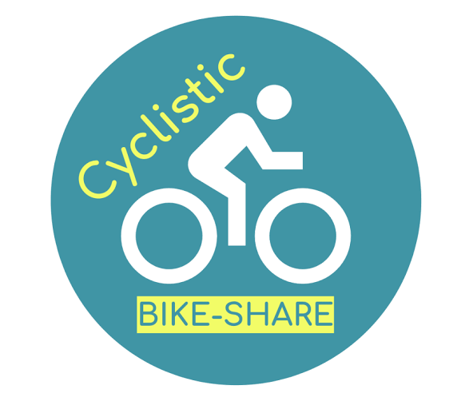

<p align="center">
  
</p>

<h2 align="center"><b>Cyclistic Data Analysis</b></h2>
<p align="center">
  A 12-year in-depth analysis of Cyclistic Case Study for the period March of 2022 to Feb of 2023.
<p>
<p align="center">
  <a href="https://github.com/armonbc/Capstone-Analysis/releases">Data Releases</a> &nbsp; &#8226; &nbsp;
  <a href="https://github.com/armonbc/Capstone-Analysis/wiki">Full Analysis</a> &nbsp; &#8226; &nbsp;
  <a href="https://github.com/armonbc/Capstone-Analysis/actions">(CI/CD) Automation Workflow</a>
</p>
<br>

#### License
- The Logs, Rscripts, and Python code in this repo are licensed under <b>MIT License</b>
`https://github.com/armonbc/Capstone-Analysis/blob/main/LICENSE.md`
```
MIT License

Copyright (c) 2023 Armon C.

Permission is hereby granted, free of charge, to any person obtaining a copy
of this software and associated documentation files (the "Software"), to deal
in the Software without restriction, including without limitation the rights
to use, copy, modify, merge, publish, distribute, sublicense, and/or sell
copies of the Software, and to permit persons to whom the Software is
furnished to do so, subject to the following conditions:

The above copyright notice and this permission notice shall be included in all
copies or substantial portions of the Software.

THE SOFTWARE IS PROVIDED "AS IS", WITHOUT WARRANTY OF ANY KIND, EXPRESS OR
IMPLIED, INCLUDING BUT NOT LIMITED TO THE WARRANTIES OF MERCHANTABILITY,
FITNESS FOR A PARTICULAR PURPOSE AND NONINFRINGEMENT. IN NO EVENT SHALL THE
AUTHORS OR COPYRIGHT HOLDERS BE LIABLE FOR ANY CLAIM, DAMAGES OR OTHER
LIABILITY, WHETHER IN AN ACTION OF CONTRACT, TORT OR OTHERWISE, ARISING FROM,
OUT OF OR IN CONNECTION WITH THE SOFTWARE OR THE USE OR OTHER DEALINGS IN THE
SOFTWARE.
```
<hr style="border:1px solid gray">

##### Automation Workflow Status
| Operations | Status |
| --------- | ------ |
| 1. Download All CSV Operations | [](https://github.com/armonbc/Capstone-Analysis/actions/workflows/csv_prepare.yml) |
| 2. Cleaning CSV Operations | [](https://github.com/armonbc/Capstone-Analysis/actions/workflows/csv_clean.yml) |
| 3. Bar Chart Creation | [](https://github.com/armonbc/Capstone-Analysis/actions/workflows/chart_bar.yml) |
| 4. Dashboard Creation | [](https://github.com/armonbc/Capstone-Analysis/actions/workflows/chart_bar.yml) |
| 5. Reports Creation | [](https://github.com/armonbc/Capstone-Analysis/actions/workflows/chart_bar.yml) |

<hr style="border:1px solid gray">

#### Overview:
- Ridedable Types Comparison (Monthly Basis)


<hr style="border:1px solid gray">

#### Full Analysis:
- https://github.com/armonbc/Capstone-Analysis/wiki

<hr style="border:1px solid gray">

#### Dataset Scope:
- 2022-03-01 to 2023-02-28

#### Public Dataset License:
- https://ride.divvybikes.com/data-license-agreement

#### Original Dataset Source:
- https://divvy-tripdata.s3.amazonaws.com/index.html

<hr style="border:1px solid gray">
